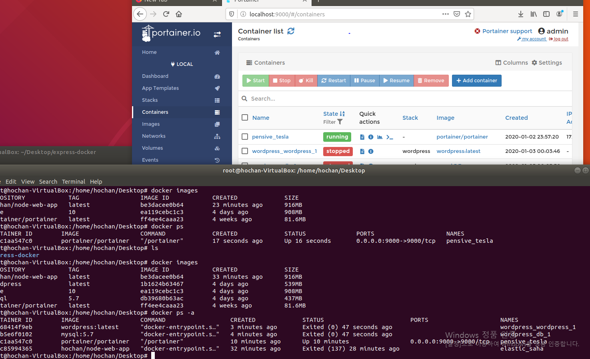

# Edge Computing

### About Kubernetes
***
**이호찬**    
> Today-I-Learned: Personal Project    

#### ✨ OpenStack Vs Kubernetes
1. [No, Kubernetes is Not the New OpenStack, Says Canonical](https://containerjournal.com/topics/container-ecosystems/no-kubernetes-is-not-the-new-openstack-says-canonical/)

###### OpenStack might appeal to telcos, which are “more prone to adopting configuration management type approaches, where workloads have to be stateful and long-running.”

###### Kubernetes, meanwhile, is better-suited for workloads that are deployed as REST- or HTTP-based services.
   
2. [Running Kubernetes at Scale Top 2020 Challenge](https://containerjournal.com/topics/container-management/running-kubernetes-at-scale-top-2020-challenge/)

###### According to the survey, 80% of respondents said they have deployed Kubernetes on a public cloud, while 50% said they have deployed Kubernetes in an on-premises IT environment. Another 12% said they have deployed Kubernetes in an edge computing environment. Of those that have deployed Kubernetes at the edge, well over a third (39%) said they are running Kubernetes in 100 or more locations. Nearly half (47%) of those respondents said they are running 11 or more servers in each location. The top two applications being deployed at the edge are edge gateways/access control (43%) and surveillance and video analytics (32%).
   
3. [OpenShift, Kubernetes and Docker: A Quick Comparison](https://containerjournal.com/topics/container-ecosystems/openshift-kubernetes-and-docker-a-quick-comparison/)

###### Kubernetes is an open source container orchestration solution hosted by Cloud Native Computing Foundation (CNCF) and backed by Google, AWS, Microsoft, IBM, Intel, Cisco Systems and Red Hat.
   
4. [Predictions 2020: The Killer App for Edge Computing in 2020 will be Kubernetes](https://containerjournal.com/topics/container-ecosystems/predictions-2020-the-killer-app-for-edge-computing-in-2020-will-be-kubernetes/)

###### -The Edge and Kubernetes Are Made for Each Other-

###### As is often the case with young technology, edge computing today is a fragmented landscape with multiple players vying for mindshare and attention. These include cloud providers, CDN providers, hosting providers, startups and telcos, each with its own different definitions and use cases

###### There are clearly endless places for edge computing to go—and endless ways for it to get there. That makes flexibility key. To enable these next-generation services while continuing to interoperate with legacy IT, the technologies that power the edge must be deployable and scalable in any type of architecture—edge, cloud or centralized. Remember that part about Kubernetes being entirely hardware and OS-independent?
 

>##### Compare Search Frequency  
>Google 검색 결과 (2019-12-26)  
>edge computing kubernetes  
>--> About 5,990,000 results (0.38 seconds)  
>edge computing OpenStack  
>--> About 919,000 results (0.39 seconds)  

 

#### 📖 Introduction Kubernetes

[Kubernetes Concepts Explained in 9 minutes!](https://www.youtube.com/watch?v=QJ4fODH6DXI&feature=emb_logo)

https://judo0179.tistory.com/57

[쿠버네티스가 SW엔지니어링과 비즈니스IT판을 뒤흔드는 이유](https://techit.kr/view/?no=20191222102610)
2019.12.22

###### 이번 글에선 쿠버네티스를 데이터센터에서 클러스터화된 서버를 위한 새로운 워크로드 배포 및 조율 메커니즘으로 묘사한다.

###### 핵심은 오케스트레이션이다

###### 사실 당신은, 여러 클라우드를 사용해 한 시스템을 개발할 수도 있다. 당신의 데이터를 많은 다양한 위치에 저장할 수 있다. 여기에선 의존할 필요가 없다. 솔직히 말하면 쿠버네티스 주도 시스템의 일부에선 중앙화되고, 특정 기술 스택에 묶이지 않는다.
 

##### TOP 6 GUI tools for managing Docker environments
[TOP 6 GUI tools for managing Docker environments](https://medium.com/@karthi.net/top-6-gui-tools-for-managing-docker-environments-ee2d69ba5a4f)

##### Install Kubernetes
[우분투 Kubernetes 설치 방법](https://www.edureka.co/blog/install-kubernetes-on-ubuntu)
[kubernetes dashboard](https://github.com/kubernetes/dashboard)

##### References
[jun108059 Kubernetes](https://github.com/jun108059/til/tree/master/kubernetes)
[Google Study Jam Cloud](https://docs.google.com/presentation/d/1FVHcAkjbiOWt7wozXfVl8Da9m9NgHSeZ85PznVKIo0w/edit?fbclid=IwAR1prUc5bIhqR28l3JnsHC1Kb7yANySbX80kx9gxzghDWPexihhy3m72bMg#slide=id.g52674f410c_0_13)
[Google Study Jam kubernetes](https://drive.google.com/file/d/11RBTPOtJ1IArI2aR5hZXqSZlpoQ3D5J7/view?fbclid=IwAR252kC3jBiVpqkfrIm45lVxxZFSmYA5WOYh0jsCjJhLo1UfVPwVRV-ed8Q)
 

#### ✏️ About Docker & Kubernetes Tutorial img  
 

#### 📖 Introduction EdgeComputing

[엣지컴퓨팅 뜨니 통신-클라우드 공룡들 합종연횡 가속](https://www.bloter.net/archives/365415)

###### 엣지컴퓨팅의 존재감이 커지는 것은 클라우드의 한계의 극복할 대안이라는 인식과 맞물려 있다.  자율주행차, 사물인터넷, 스마트팩토리 등 디지털 환경에서 실시간으로 데이터를 처리해야 하는 흐름은 확산되고 있는데, 멀리 떨어져 있는 클라우드만으로는 이같은 요구 사항을 맞춰주기 어렵고, 엣지컴퓨팅이 해결사가 될 것으로 관련 업계는 보고 있다.

###### 실시간 데이터 처리를 위해서는 데이터가 발생하는 물리적인 위치 근처에 관련 컴퓨팅 인프라를 투입하는 것이 현실적이고, 엣지컴퓨팅은 엣지 컴퓨팅은 각종 기기 근처에 소규모 서버들, 이른바 엣지 네트워크를 배치해 지연시간(레이턴시) 문제를 해결하는데 초점이 맞춰져 있다.

[What is edge computing and why it matters](https://www.networkworld.com/article/3224893/what-is-edge-computing-and-how-it-s-changing-the-network.html)

###### Edge computing allows data from internet of things devices to be analyzed at the edge of the network before being sent to a data center or cloud.

###### Increasingly, though, the biggest benefit of edge computing is the ability to process and store data faster, enabling for more efficient real-time applications that are critical to companies.

[Forrester: Edge computing is about to bloom](https://www.networkworld.com/article/3451532/forrester-edge-computing-is-about-to-bloom.html)

###### While edge computing is primarily an IoT-related phenomenon, Forrester said that addressing the need for <Strong>on-demand compute and real-time</Strong> app engagements will also play a role in driving the growth of edge computing in 2020.
 

#### 📖 Introduction KudeEdge
>Kubernetes Native Edge Computing Framework (project under CNCF) - https://kubeedge.io

>Git - https://github.com/kubeedge/kubeedge

>Docs - https://kubeedge.readthedocs.io/en/latest/

>Examples - https://github.com/kubeedge/examples

 

##### About Backgrounds

[MQTT (MQ Telemetry Transport, Message Queue Telemetry Transport)](https://sarc.io/index.php/miscellaneous/916-mqtt-mq-telemetry-transport-message-queue-telemetry-transport)

> ###### MQTT는 경량의 Publish/Subscribe 처리를 위한, IoT 메시지 처리를 위한 경량 프로토콜이다.

[Kitematic](https://kitematic.com/)
> [About Kitematic](https://jhhwang4195.tistory.com/109)

 

#### 📂 Architecture    

#### 👨‍ testing     

***
### 참고자료

* [KudeEdge](https://kubeedge.io/en/)
* [MEC(Multi-Access Edge Computing)란?](https://www.juniper.net/kr/kr/products-services/what-is/multi-access-edge-computing/)
* [VM Static Hosting Network config_ubuntu](https://blog.hkwon.me/virtualbox-hoseuteu-jeonyong-eodaebteo-seoljeong-2/)